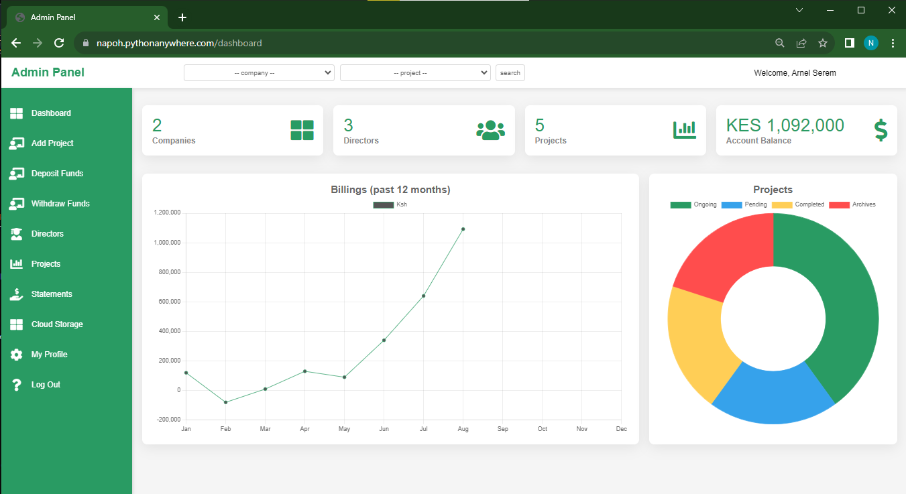
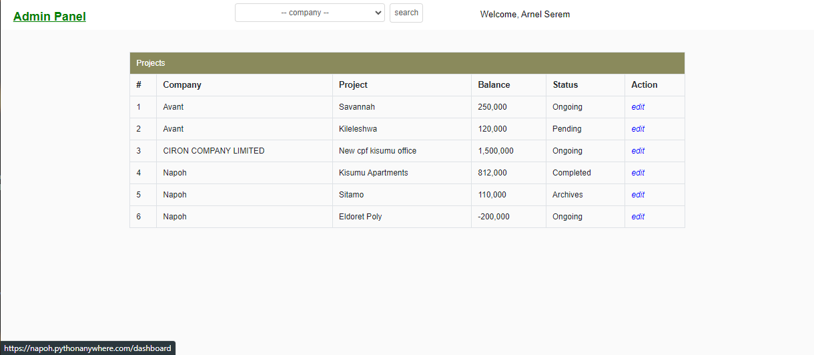
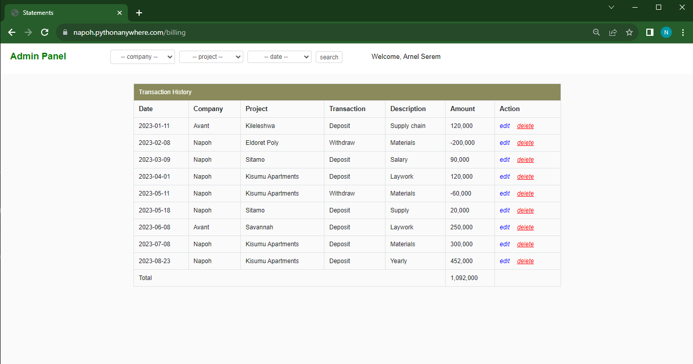
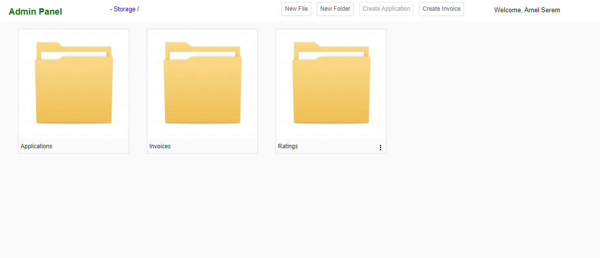
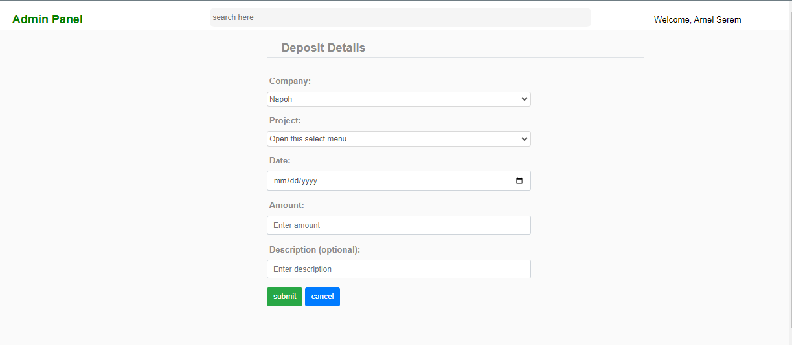
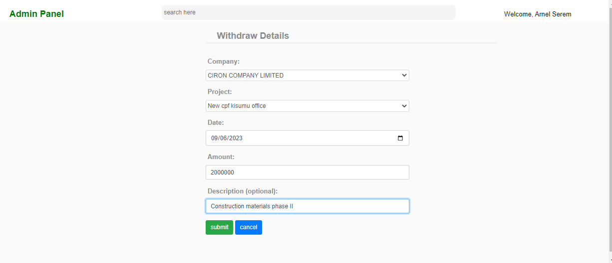

# Project Financial Management System
Web application that allows financial tracking of multiple subsidriaes of a company. Application allows creation of countless branches and companies.
It keeps track of inflow and outflow of money into individual projects.
Additional, it provides real time graphical analysis of financial performance of projects.
It supports filtering to investigate performance on company stage or aspects from individual projects.
Moreover, it provide cloud storage for project related documents such tax documents, invoices and company certificates.

## Main Dashboard

## Projects

## Statements

## Cloud Storage

## Deposit

## Withdraw

